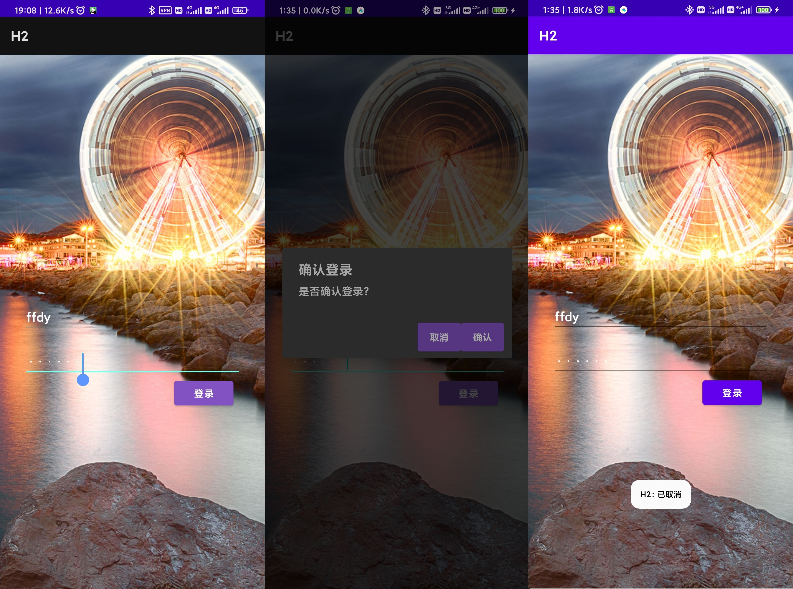
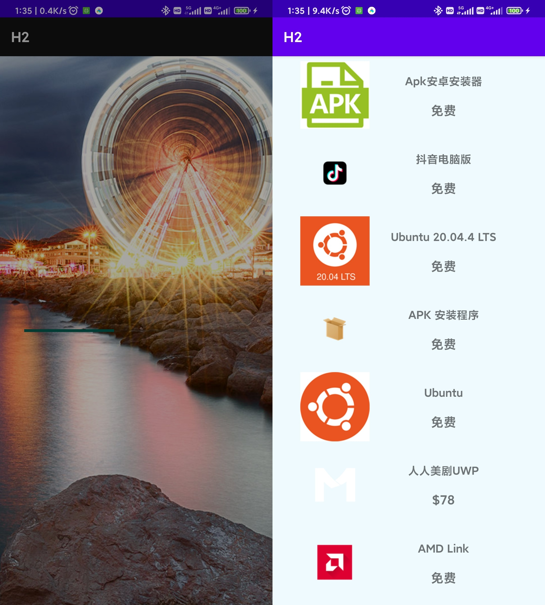

# 移动平台开发作业2

## 效果图

## 涉及知识点

 - 常用基本控件的使用，包含`EditText` `TextView` `Button` `ImageView` `ProgressBar` `AlertDialog` `Guideline` 等
 - `ConstraintLayout` 的使用及其内部约束
 - `RecyclerView` 的使用，配合 `Adapter` 和 `ViewHolder` 进行多条目动态渲染展示
 - 实时拓展基本控件的类方法如 `TextView` 的文本监听和 `Button` 绑定事件
 - 使用计时器实现进度条效果，包含线程的创建和线程间交互（两种方法，推荐使用 `Handler(Looper.getMainLooper()).post{}`）