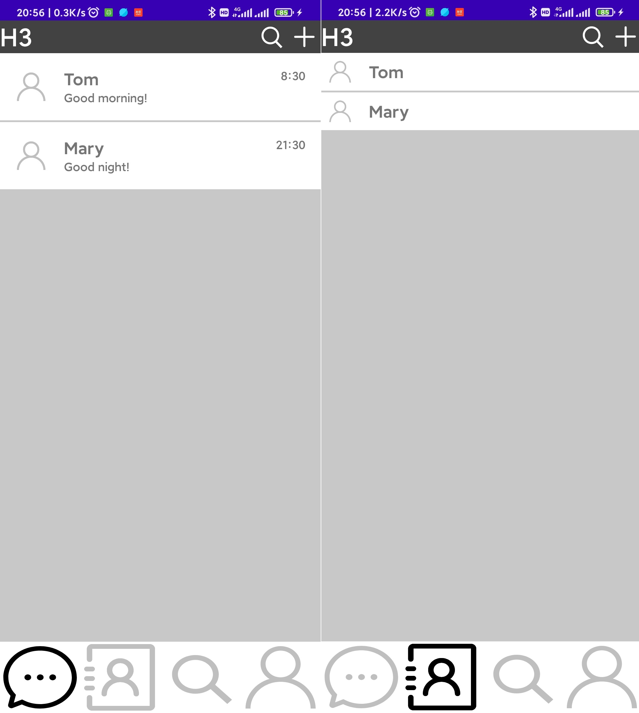
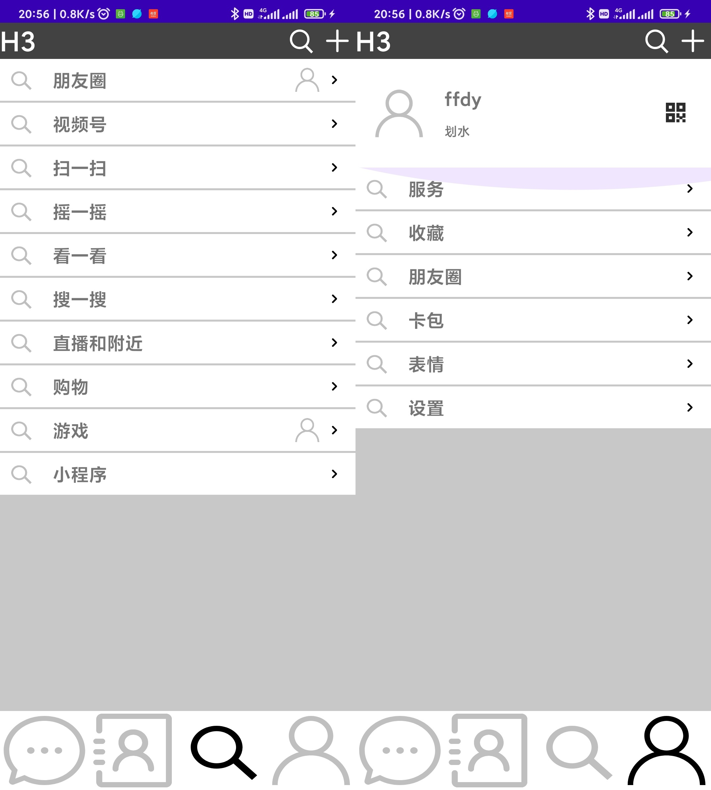

# 移动平台开发作业3

## 效果图

## 涉及知识点

 - 常用基本控件的使用，包含 `TextView` `Button` `ImageView`等
 - `ConstraintLayout` 的使用及其内部约束
 - `fragment`及`FragmentContainerView`的原理和运用
 - `RecyclerView` 的使用，配合 `Adapter` 和 `ViewHolder` 进行多条目动态渲染展示
 - 实时拓展基本控件的类方法如 `TextView` 和 `Button` 绑定事件
 - 多控件之间嵌套
 - 在`fragment`中调用`activity`的相关方法（`context`，`requireActivity() as MainActivity`）
 - 向量图的原理和使用